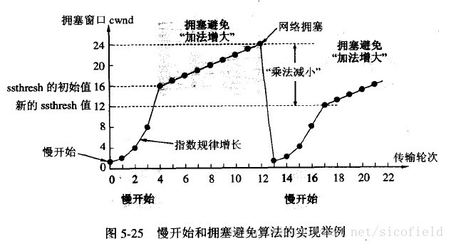

### 综合：

#### 1 各层网络协议，每一层的作用

OSI七层协议模型主要是：应用层（Application）、表示层（Presentation）、会话层（Session）、传输层（Transport）、网络层（Network）、数据链路层（Data Link）、物理层（Physical）。

五层体系结构包括：应用层、传输层、网络层、数据链路层和物理层。

| 分层       | 作用                                                | 协议                                                |
| ---------- | --------------------------------------------------- | --------------------------------------------------- |
| 物理层     | 通过媒介传输比特，确定机械及电气规范（比特 Bit）    | RJ45、CLOCK、IEEE802.3（中继器，集线器）            |
| 数据链路层 | 将比特组装成帧和点到点的传递（帧 Frame）            | PPP、FR、HDLC、VLAN、MAC（网桥，交换机）            |
| 网络层     | 负责数据包从源到宿的传递和网际互连（包 Packet）     | IP、ICMP、ARP、RARP、OSPF、IPX、RIP、IGRP（路由器） |
| 运输层     | 提供端到端的可靠报文传递和错误恢复（ 段Segment）    | TCP、UDP、SPX                                       |
| 会话层     | 建立、管理和终止会话（会话协议数据单元 SPDU）       | NFS、SQL、NETBIOS、RPC                              |
| 表示层     | 对数据进行翻译、加密和压缩（表示协议数据单元 PPDU） | JPEG、MPEG、ASII                                    |
| 应用层     | 允许访问OSI环境的手段（应用协议数据单元 APDU）      | FTP、DNS、Telnet、SMTP、HTTP、WWW、NFS              |

#### 2 输入网址访问网站涉及到哪些网络协议

- 首先是域名解析，客户端使用**DNS协议**将URL解析为对应的IP地址；
- 然后建立**TCP**连接，客户端与服务器通过三次握手建立TCP连接；
- 接着是**http连接**，客户端向服务器发送http连接请求； （http连接无需额外连接，直接通过已经建立的TCP连接发送）
- 服务器对客户端发来的http请求进行处理，并返回响应；
- 客户端接收到http响应，将结果渲染展示给用户。

### TCP/IP协议

#### 3 TCP三次握手，哪次可以发送数据，为什么，ACK和SYN的含义。

ACK：确认序号有效

SYN：同步序号，用来发起一个连接

理论上第三次可以发送数据，SYN不允许携带数据，但占据一个序列号。

#### 4 tcp流量控制（接收窗口）

所谓流量控制，就是**让发送端不要发送的过快，让接收端能来得及接收**。

* 需要流量控制的原因

假设没有流量控制，发送端根据自己的实际情况发送数据，如果发送的速度太快，导致接收端的接收缓冲区很快填满了，此时发送端如果继续发送数据，接收端处理不过来，这时接收端就会把本来应该接收的数据丢弃，这会触发发送端的重发机制，从而导致网络流量的无端浪费。

所以TCP需要提供一种机制：**让发送端根据接收端实际的接收能力控制发送的数据量**。这就是所谓的流量控制。

* 滑动窗口

TCP 利用**滑动窗口**实现流量控制的机制， 而滑动窗口大小是通过TCP首部的窗口大小字段来通知对方。

在TCP协议的头部信息当中，有一个16位字段的窗口大小，窗口大小的内容实际上是接收端接收数据缓冲区的剩余大小。**这个数字越大，证明接收端接收缓冲区的剩余空间越大，网络的吞吐量越大。**

流量控制的具体操作就是：接收端会在确认应答发送ACK报文时，将自己的即时窗口大小rwnd（receiver window）填入，并跟随ACK报文一起发送过去。而发送方根据ACK报文里的窗口大小的值进而改变自己的发送速度。

如上图所示，主机B接收到了一个1-1000序列号的数据包以后，返回一个ACK给发送端，并且告诉发送端它的窗口大小为3000，意味着发送端还能发送3000个字节的数据。

主机A收到指示后，继续发送数据，直到主机B收到3001-4000的数据段后其接收缓冲区满了，主机B的返回窗口大小为0，让主机A要暂停发数据了。

就是这样一个流程，可以防止发送端一次发送过大的数据导致接收端无法处理的情况。

那么另外一个问题来了：**发送端停止发送数据后，什么时候可以继续发送数据呢？**

我们继续看上图，答案就是等接收端处理完了缓冲区的数据后发送一个**窗口更新**的数据包通知，发送端才可以继续根据窗口大小发送数据。

但是如果发送端在重发超时的时间内都没有收到窗口更新的通知或者窗口更新的包丢失了，就没法正常通信了，那怎么办呢？

TCP为每一个连接设有一个**持续计时器(persistence timer)。** 只要TCP连接的一方收到对方的零窗口通知，就启动持续计时器。若持续计时器设置的时间到期，就发送一个零窗口探测数据段（这个数据段只包含一个字节），那么收到这个报文段的一方就重新设置持续计时器。

所以发送端会定时向接收端发送一个 **窗口探测** 的数据段，这目的是为了获取最新的窗口大小信息。

就这样，完成了TCP流量控制的整个过程。

#### tcp拥塞控制

* 定义

  **拥塞控制**就是防止过多的数据注入到网络中，这样可以防止网络中的路由器或链路不致过载。拥塞控制所要做的都有一个前提，就是网络能够承受现有的网络负荷。

* 实现

  **拥塞窗口（cwnd）**是指发送方维护的一个根据网络状况动态变化的窗口。一般来说，发送方会让自己的发送窗口等于拥塞窗口和接收端接收窗口的较小值。

  拥塞控制有四种算法，**慢启动、拥塞避免，快速重传和快速恢复**

  

  （1）**慢启动**。慢启动算法的思路是当主机开始发送数据时，先以比较小的拥塞窗口进行发送，然后每次翻倍，也就是说，由小到大逐渐增加拥塞窗口的大小，而这个大小是指数增长的，即1、2、4、8、16。
  *为了防止拥塞窗口cwnd增长过大引起网络拥塞，还要另外设置一个慢启动阈值ssthresh状态变量。

  ssthresh具体作用如下：

  cwnd < ssthresh , 使用慢开始算法

  cwnd = ssthresh , 使用慢开始算法或拥塞避免算法都可以

  cwnd > ssthresh , 使用拥塞避免算法

  **还有一个问题就是这个 ssthresh 是怎么设置的呢？**

  TCP/IP 中规定无论是在慢开始阶段还是在拥塞避免阶段，只要发现网络中出现拥塞（没有按时收到确认），就要把ssthresh设置为此时发送窗口的一半大小（不能小于2）。

  （2）**拥塞避免**。拥塞避免算法的思路是让拥塞窗口cwnd缓慢地增大，即每经过一个往返时间RTT就把发送方的拥塞窗口cwnd加1，而不是加倍。如果发现出现网络拥塞的话就按照上面的方法重新设置**ssthresh**的大小（乘法减小），即ssthresh = cwnd / 2，并从cwnd=1开始重新执行**慢开始**算法。

  （3）**快速重传**。让发送方尽早知道发生了个别报文段的丢失。当发送端连续收到三个重复的ack时，表示该数据段已经丢失，需要重发，这样就不会出现超时，发送方也就不会误认为出现了网络拥塞。

  

  （4）**快速恢复**。配合快速重传。如下图中的点4，发送方知道现在只是丢失了个别的报文段，于是不启动慢开始，而是执行快速恢复算法。此时慢启动阈值ssth变为原来一半，拥塞窗口cwnd变为ssthresh 或 ssth+3，并开始执行拥塞避免算法。

  

  ​	在拥塞避免阶段，拥塞窗口是按照线性规律增大的，这常称为加法增大AI（Additive Increase）。而一旦出现超时或3个重复的确认，就要把门限值设置为当前拥塞窗口值的一半，并大大减小拥塞窗口的数值，这常称为“乘法减小”MD(Multiplication Decrease).二者合在一起就是所谓的AIMD算法。

#### 5 tcp粘包

因为TCP为了减少额外开销，采取的是流式传输，所以接收端在一次接收的时候有可能一次接收多个包。而TCP粘包就是发送方的若干个数据包到达接收方的时候粘成了一个包。多个包首尾相接，无法区分。

导致TCP粘包的原因有三方面：

* 发送端等待缓冲区满才进行发送，造成粘包
* 接收方来不及接收缓冲区内的数据，造成粘包
* 由于TCP协议在发送较小的数据包的时候，会将几个包合成一个包后发送

避免粘包的措施：

* 发送定长包。如果每个消息的大小都是一样的，那么在接收对等方只要累计接收数据，直到数据等于一个定长的数值就将它作为一个消息。
* 包头加上包体长度。包头是定长的 4 个字节，说明了包体的长度。接收对等方先接收包头长度，依据包头长度来接收包体。
* 在数据包之间设置边界，如添加特殊符号 `\r\n` 标记。FTP 协议正是这么做的。但问题在于如果数据正文中也含有 `\r\n`，则会误判为消息的边界。

#### 6 tcp封包与拆包

TCP是面向字节流的，把数据看成一连串无结构的字节流，因此会出现黏包问题。因为TCP是无边界的流传输，所以需要对TCP进行封包和拆包，确保发送和接收的数据不粘连。

* 封包：封包就是在发送数据报的时候为每个TCP数据包加上一个包头，将数据报分为包头和包体两个部分。包头是一个固定长度的结构体，里面包含该数据包的总长度。
* 拆包：接收方在接收到报文后提取包头中的长度信息进行截取。

#### 7 TCP如何保证可靠性，数据报的检验机制

(**校序重流拥**)

* 校验和
  发送的数据包的二进制相加然后取反，目的是检测数据在传输过程中的任何变化。如果收到段的检验和有差错，TCP将丢弃这个报文段和不确认收到此报文段。 

  **当发送IP包时，需要计算IP报头的校验和：**

  1、 把校验和字段置为0；

  2、 对IP头部中的每16bit进行二进制求和；

  3、 如果和的高16bit不为0，则将和的高16bit和低16bit反复相加，直到和的高16bit为0，从而获得一个16bit的值；

  4、 将该16bit的值取反，存入校验和字段。

  ◆当接收IP包时，需要对报头进行确认，检查IP头是否有误，算法同上2、3步，然后判断取反的结果是否为0，是则正确，否则有错。

* 确认应答+序列号
  TCP给发送的每一个包进行编号，接收方对数据包进行排序，把有序数据传送给应用层。 
* 超时重传
  当TCP发出一个段后，它启动一个定时器，等待目的端确认收到这个报文段。如果不能及时收到一个确认，将重发这个报文段。 

* 流量控制
  TCP连接的每一方都有固定大小的缓冲空间，TCP的接收端只允许发送端发送接收端缓冲区能接纳的数据。当接收方来不及处理发送方的数据，能提示发送方降低发送的速率，防止包丢失。TCP使用的流量控制协议是可变大小的滑动窗口协议。
  接收方有即时窗口（滑动窗口），随ACK报文发送

* 拥塞控制
  当网络拥塞时，减少数据的发送。
  发送方有拥塞窗口，发送数据前比对接收方发过来的接收窗口，取小

#### 8 TCP和UDP的区别以及应用场景

* TCP面向连接,UDP是无连接的；
* TCP提供可靠的服务，即通过TCP连接传送的数据，无差错，不丢失，不重复，且按序到达；UDP尽最大努力交付，即不保证可靠交付；
* TCP的逻辑通信信道是全双工的可靠信道；UDP则是不可靠信道；
* 每一条TCP连接只能是点到点的；UDP支持一对一，一对多，多对一和多对多的交互通信；
* TCP面向字节流（可能出现黏包问题),实际上是TCP把数据看成一连串无结构的字节流；UDP是面向报文的（不会出现黏包问题）；
* UDP没有拥塞控制，因此网络出现拥塞不会使源主机的发送速率降低（对实时应用很有用，如 IP 电话，实时视频会议等）
* TCP首部开销20字节；UDP的首部开销小，只有8个字节。

#### TCP和UDP对应的协议有哪些

* TCP

  HTTP协议：超文本传输协议，用于普通浏览

  HTTPS协议：安全超文本传输协议，身披SSL外衣的HTTP协议

  FTP协议：文件传输协议，用于文件传输

  POP3协议：邮局协议，收邮件使用

  SMTP协议：简单邮件传输协议，用来发送电子邮件

  Telent协议：远程登陆协议，通过一个终端登陆到网络

  SSH协议：安全外壳协议，用于加密安全登陆，替代安全性差的Telent协议

* UDP

  DHCP协议：动态主机配置协议，动态配置IP地址

  DNS协议：用于域名解析服务。

  SNMP：简单网络管理协议，使用161号端口，是用来管理网络设备的。由于网络设备很多，无连接的服务就体现出其优势。

#### 9 TCP头部包含哪些内容

TCP的头部大致包括：源端口，目的端口，序号，确认号，偏移位，标志位，校验和等等

UDP的头部则包括：源端口，目的端口，长度，校验和。

IP数据包的头部包括：源IP地址，目的IP地址，协议，校验和，总长度等等

### HTTP

#### 10 http状态码

详见 [HTTP状态码的含义](https://blog.csdn.net/u011630575/article/details/46636535)

常见的状态码有：

>* 200 - 请求成功
>* 301 - 资源（网页等）被永久转移到其它URL
>* 404 - 请求的资源（网页等）不存在
>* 500 - 内部服务器错误
>* 400 - 请求无效 
>* 403 - 禁止访问 

状态码（Status-Code）

- 1xx：表示通知信息，如请求收到了或正在进行处理
  - 100 Continue：继续，客户端应继续其请求
  - 101 Switching Protocols 切换协议。服务器根据客户端的请求切换协议。只能切换到更高级的协议，例如，切换到 HTTP 的新版本协议
- 2xx：表示成功，如接收或知道了
  - 200 OK: 请求成功
- 3xx：表示重定向，如要完成请求还必须采取进一步的行动
  - 301 Moved Permanently: 永久移动。请求的资源已被永久的移动到新 URL，返回信息会包括新的 URL，浏览器会自动定向到新 URL。今后任何新的请求都应使用新的 URL 代替
- 4xx：表示客户的差错，如请求中有错误的语法或不能完成
  - 400 Bad Request: 客户端请求的语法错误，服务器无法理解
  - 401 Unauthorized: 请求要求用户的身份认证
  - 403 Forbidden: 服务器理解请求客户端的请求，但是拒绝执行此请求（权限不够）
  - 404 Not Found: 服务器无法根据客户端的请求找到资源（网页）。通过此代码，网站设计人员可设置 “您所请求的资源无法找到” 的个性页面
  - 408 Request Timeout: 服务器等待客户端发送的请求时间过长，超时
- 5xx：表示服务器的差错，如服务器失效无法完成请求
  - 500 Internal Server Error: 服务器内部错误，无法完成请求
  - 503 Service Unavailable: 由于超载或系统维护，服务器暂时的无法处理客户端的请求。延时的长度可包含在服务器的 Retry-After 头信息中
  - 504 Gateway Timeout: 充当网关或代理的服务器，未及时从远端服务器获取请求

#### 11 HTTP的请求方式，其中get和post的区别

请求方法

| 方法    | 意义                                                         |
| ------- | ------------------------------------------------------------ |
| OPTIONS | 请求一些选项信息，允许客户端查看服务器的性能                 |
| GET     | 请求指定的页面信息，并返回实体主体                           |
| HEAD    | 类似于 get 请求，只不过返回的响应中没有具体的内容，用于获取报头 |
| POST    | 向指定资源提交数据进行处理请求（例如提交表单或者上传文件）。数据被包含在请求体中。POST请求可能会导致新的资源的建立和/或已有资源的修改，不是幂等性的。 |
| PUT     | 从客户端向服务器传送的数据取代指定的文档的内容               |
| DELETE  | 请求服务器删除指定的页面                                     |
| TRACE   | 回显服务器收到的请求，主要用于测试或诊断                     |

get和post的区别：

1. get方法不会修改服务器上的资源，它的查询是没有副作用的，而post有可能会修改服务器上的资源
2. get可以保存为书签，可以用缓存来优化，而post不可以
3. get把请求附在url上，而post把参数附在http包的包体中
4. 浏览器和服务器一般对get方法所提交的url长度有限制，一般是1k或者2k，而对post方法所传输的参数大小限制为80k到4M不等
5. post可以传输二进制编码的信息，get的参数一般只支持ASCII

#### 12 http与https的区别

http 是超文本传输协议，信息是明文传输， https 则是具有安全性的 ssl 加密传输协议；
http 和 https 使用的是完全不同的连接方式，用的端口也不一样，前者是 80 ，后者是 443；
http 的连接很简单，是无状态的； HTTPS 协议是由 SSL+HTTP 协议构建的可进行加密传输、身份认证的网络协议，比http 协议安全。
https 协议需要到 ca 申请证书，一般免费证书较少，因而需要一定费用
https://www.cnblogs.com/wqhwe/p/5407468.html

#### 13 https的加密方式（https传输过程中，之后的方法是对称方法还是非对称）

**SSL是传输层的协议**（Secure Sockets Layer 安全套接字协议)

https包括非对称加密和对称加密两个阶段，在客户端与服务器建立连接的时候使用非对称加密，连接建立以后使用的是对称加密。

1. 客户使用https的URL访问Web服务器，要求与Web服务器建立SSL连接
2. Web服务器收到客户端请求后，会将网站的公钥传送一份给客户端，私钥自己保存。
3. 客户端的浏览器根据双方同意的安全等级，生成对称加密使用的密钥，称为会话密钥，然后利用网站的公钥将会话密钥加密，并传送给网站
4. Web服务器利用自己的私钥解密出会话密钥。
5. Web服务器利用会话密钥加密与客户端之间的通信，这个过程是对称加密的过程。

服务器第一次传给客户端的公钥其实是CA对网站信息进行加密的数字证书

客户端的对称加密密钥其实是三个随机数的哈希（1. 客户端第一次给服务端发送请求时附带的随机数 2. 服务器返回时的随机数 3. 客户端收到返回时的随机数）

#### 14 对称密码和非对称密码体系

https://blog.csdn.net/qq_29689487/article/details/81634057

* 对称加密：加密和解密使用的密钥是同一个
  * 优点：计算量小，算法速度快，加密效率高  缺点：密钥容易泄漏。不同的会话需要不同的密钥，管理起来很费劲
  * 常用算法：DES，3DES，IDEA，CR4，CR5，CR6，AES
* 非对称加密：需要公钥和私钥，公钥用来加密，私钥用来解密
  * 优点：安全，不怕泄漏  缺点：速度慢
  * 常用算法：RSA，ECC，DSA

#### 15 CA证书是什么，数字证书的作用

权威CA使用私钥将网站A的信息和消息摘要（签名S）进行加密打包形成数字证书。公钥给客户端。

网站A将自己的信息和数字证书发给客户端，客户端用CA的公钥对数字证书进行解密，得到签名S，与手动将网站的信息进行消息摘要得到的结果S\*进行对比，如果签名一致就证明网站A可以信任。

#### 16 DNS解析过程

DNS域名解析：域名->IP地址

DNS解析有两种方式：递归查询和迭代查询

* 递归查询 用户先向本地域名服务器查询，如果本地域名服务器的缓存没有IP地址映射记录，就向根域名服务器查询，根域名服务器就会向顶级域名服务器查询，顶级域名服务器向权限域名服务器查询，查到结果后依次返回。
* 迭代查询 用户向本地域名服务器查询，如果没有缓存，本地域名服务器会向根域名服务器查询，根域名服务器返回顶级域名服务器的地址，本地域名服务器再向顶级域名服务器查询，得到权限域名服务器的地址，本地域名服务器再向权限域名服务器查询得到结果

#### 17 DNS劫持

 通过攻击域名解析服务器或者伪造域名解析服务器的方法，把目标网站域名解析到错误的地址。

#### 18 一个电脑接入局域网以后分配一个IP地址，是如何实现的

#### 19 公网设备怎么访问内网的设备，有什么技术可以实现。或者说局域网下的设备和公网怎么通信？